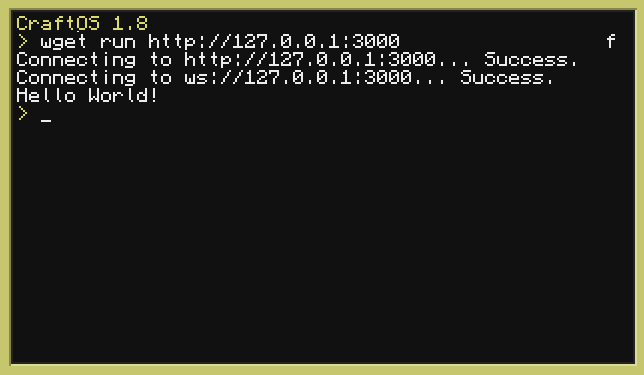

# computercraft-server

A Node.js package providing a low-level command and control server for ComputerCraft computers in Minecraft.
Allowing control over these in game computers with Node.js instead of Lua.

Thank you wwaaijer for the [base and inspiration](https://github.com/wwaaijer/cc-socket-server) for this project!

---

## Disclaimer

This project is currently NOT uploaded to NPM because it is entirely UNFINISHED, do not use it unless you are okay with some missing Peripherals and Global wrappers.

If you are, please disreguard the "Install the package" step and manually install it using git:

```
npm install git+https://github.com/UnusualNorm/ComputerCraft-CC-Server
```

---

This project is meant to be used with the `CC:Tweaked` Minecraft mod:

- [https://github.com/SquidDev-CC/CC-Tweaked](https://github.com/SquidDev-CC/CC-Tweaked)
- [https://tweaked.cc/](https://tweaked.cc/)

This package provides provides:

- An HTTP server serving the lua script and handling connections
- A simple wrapper for CC: Tweaked api's. (globals, peripherals, etc...)
- Easy and low-level management of ComputerCraft computers

## Known Issues

- If the server disconnects, the client crashes, this isn't a big deal
- Not all globals are currently wrapped
- No peripherals have been wrapped
- No JSDoc for any function

# Usage

## Setting up a Control Server

Install the package:

```
npm install computercraft-cc-server
```

Create a file, `server.js`, with the content:

```js
const { Server } = require('computercraft-server');

const port = 3000;
const server = new Server();

server.on('connection', async (computer) => {
  console.log(`New connection from ${await computer._HOST}!`);
  // "New connection from ComputerCraft XX.XX.XX (Minecraft XX.XX)"
  await computer.print(`Hello from NodeJS ${process.version}!`);
  // "Hello from NodeJS vXX.XX.XX!"
});

server.listen(port);
console.log(`Listening on port ${port}!`);
```

Start the server:

```
node server.js
```

## Allow your ComputerCraft computers to connect to your server

Before you hop into a Minecraft world. You want to make sure ComputerCraft allows connections to the correct address.

To make this work you'll need to allow connections to your localhost as described here:
[Allowing access to local IPs](https://github.com/SquidDev-CC/CC-Tweaked/wiki/Allowing-access-to-local-IPs)

## Connect a ComputerCraft computer to the control server

Switch to Minecraft and open up the terminal of the computer/turtle you would like to control with the server.
In the terminal of the computer/turtle use the `wget` program to download and run the Lua script exposed by the server:

```
wget run http://localhost:3000
```

The computer will retrieve a Lua script from the server with instructions to open up a web socket.
From then on your javascript code will have control of the ComputerCraft computer/turtle.



> If you see `Domain not permitted`, your ComputerCraft configuration is not correct yet.
> Make sure you complete the step, "Allow your ComputerCraft computers to connect to your server".

## Working with return values

All commands return an array with 1 or 2 values.
The first value being the result and the second value being details to the result, if applicable.

For instance for the `turtle.inspect()` command.
The first value will state if a block was detected.
The second value will contain the block that it detected.

```js
const turtle = new Turtle(computer);
const { success, details } = await turtle.inspect();

console.log('Inspection successful:', success);
console.log('Inspection details:', details);
```

Output:

```
Inspection success: true
Inspection details: {
  name: 'minecraft:birch_log',
  state: { axis: 'y' },
  tags: {
    'minecraft:logs_that_burn': true,
    'minecraft:birch_logs': true,
    'minecraft:logs': true
  }
}
```

Or, for when a movement command of a turtle fails like the `turtle.down()` command:

```js
const turtle = new Turtle(computer);
const { success, details } = await turtle.down();

console.log('Move successful:', successful);
console.log('Move details:', details);
```

The output would be:

```
Move successful: false
Move details: Movement obstructed
```
